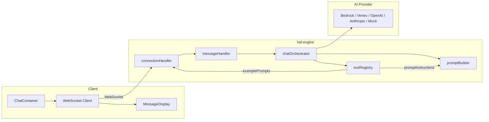
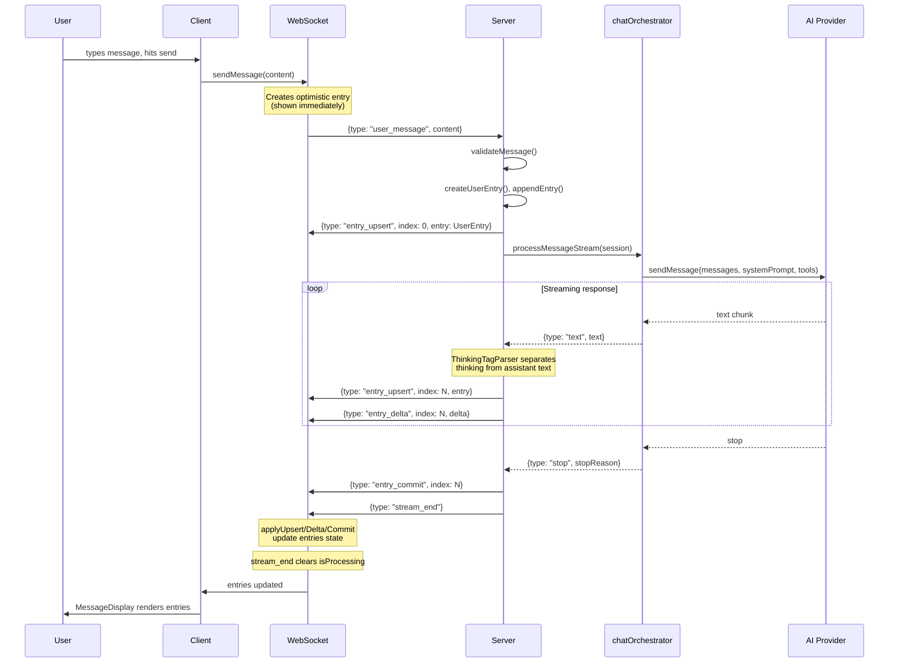
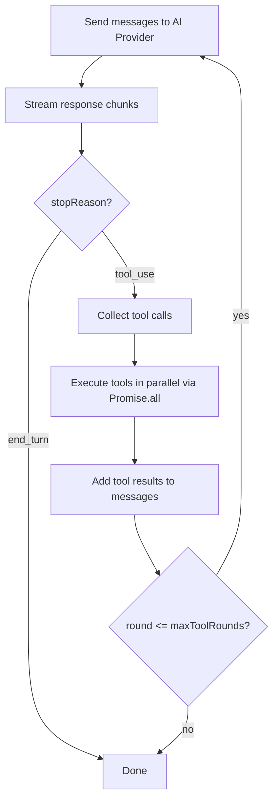

# Architecture

| Field  | Value       |
| ------ | ----------- |
| Issue  | n/a         |
| Status | In Progress |

This document walks through how the hal-engine system works, from the moment a user types a message to the moment they see a streaming response.

## The Big Picture

The system has three layers: a frontend client, a Node.js backend (hal-engine), and a pluggable AI provider. They communicate over WebSocket for real-time streaming.

Only the middle layer is this repository. The `Client` group below, the `applyUpsert`/`applyDelta`/`applyCommit` functions in Entry Streaming Protocol, the reconnection and unmount behaviour under Connection Lifecycle, and the spinner logic in Tool Execution Loop all describe a browser client. They are here because the protocol only makes sense as a pair, not because any of it ships from here.



## Source Layering

### Background

`src/` is five mandatory layers plus two cross-cutting folders, and the direction of import between them is the architecture rather than a convention. `layers.yaml` declares it as data and `re-lint/no-cross-layer-import` enforces it, so a shortcut fails lint rather than review. The documented order — types → providers → infrastructure → orchestration → transport — reads as a chain; the real graph is the DAG below.

### The declared graph

- `providers` is a sibling of `infrastructure`, not a link in the chain: neither may import the other, and both may reach `types` and `shared` and nothing further ([validated by](../../scripts/eslint-layers.test.ts#L61)).
- `orchestration` may not import `providers`: it depends on the `AIProvider` interface in `types` and never on a concrete provider, which is the property that lets a provider be swapped by configuration alone ([validated by](../../scripts/eslint-layers.test.ts#L38)).
- `types` is the bottom layer and may import nothing, so every import out of it is upward and is reported ([validated by](../../scripts/eslint-layers.test.ts#L46)).
- An import the layering does declare passes untouched, and movement inside a layer is free ([validated by](../../scripts/eslint-layers.test.ts#L52)).
- The gate governs files under `src/`, and that scope is checked rather than assumed: a matcher which silently matches nothing fails the suite ([validated by](../../scripts/eslint-layers.test.ts#L110)).
- `shared` is cross-cutting: every layer above `types` may reach the logger it holds, and `types` is not among them — it may import nothing at all, the logger included ([validated by](../../scripts/eslint-layers.test.ts#L83)).
- `shared` itself imports nothing, which keeps it a leaf rather than a second composition root ([validated by](../../scripts/eslint-layers.test.ts#L77)).
- `.` — `src/config.ts` and `src/index.ts` — is the composition root, the one place allowed to see every layer, because assembling them is its job ([validated by](../../scripts/eslint-layers.test.ts#L93)).
- A folder with no entry in `layers.yaml` may import nothing, which is what keeps that file honest as `src/` grows ([validated by](../../scripts/eslint-layers.test.ts#L102)).

### Rationale

This gate's failure mode is silence rather than a false report, which is why the suite pins that it still reports at all. The rule keys packages by `<package>/src/`, a shape that suits a monorepo of packages and not a single package whose code sits at `./src`. Left to locate `layers.yaml` on its own it resolves every file as `src/...`, matches no package and reports nothing — adopted in appearance, enforcing nothing. `eslint.config.mjs` re-homes the entries under this checkout's own directory name, with the root moved one level up, to give the matcher the shape it expects.

## Pluggable Interfaces

### Background

hal-engine is designed around pluggable interfaces that let consumers customize behavior without modifying internals.

### SessionStore

Controls where session data is stored: the default `InMemorySessionStore` keeps sessions in a `Map` ([validated by](../../src/infrastructure/stores/inMemorySessionStore.test.ts#L10)). Implement this interface to persist sessions in Redis, a database, or any other backing store. The store is generic -- pass your own session type extending `BaseSession`.

<!-- doc-block: src/types/sessionStore.ts#SessionStore -->
```typescript
interface SessionStore<T extends BaseSession = ChatSession> {
  create(sessionId: string, userId: string | number, options?: SessionCreateOptions): T;
  get(sessionId: string): T | undefined;
  delete(sessionId: string): boolean;
  count(): number;
  clear(): void;
}
```

- `create` records the optional `authHeaders` and `workspaceId` on the session it returns, so a tool can later reach upstream services as the caller ([validated by](../../src/infrastructure/stores/inMemorySessionStore.test.ts#L19)).
- `get` returns `undefined` for a session id the store does not hold, rather than throwing ([validated by](../../src/infrastructure/stores/inMemorySessionStore.test.ts#L31)).
- `delete` removes the session and reports `true` ([validated by](../../src/infrastructure/stores/inMemorySessionStore.test.ts#L35)).
- `delete` reports `false` for an id the store was not holding ([validated by](../../src/infrastructure/stores/inMemorySessionStore.test.ts#L42)).
- `count` reflects creates and deletes as they happen ([validated by](../../src/infrastructure/stores/inMemorySessionStore.test.ts#L46)).
- `clear` empties the store, leaving `count` at zero and every previous id unresolvable ([validated by](../../src/infrastructure/stores/inMemorySessionStore.test.ts#L60)).

### WsAuthenticator

Authenticates WebSocket connections during the handshake. It receives the whole Node `IncomingMessage`, not a pre-extracted token, so it can read credentials from wherever the client put them. Return the authenticated user to accept the connection, or `null` to reject it with HTTP 401 -- a rejection is a returned `null`, not a thrown error.

<!-- doc-block: src/types/auth.ts#WsAuthenticator -->
```typescript
type WsAuthenticator = (req: IncomingMessage) => Promise<AuthenticatedUser | null>;
```

<!-- doc-block: src/types/session.ts#AuthenticatedUser -->
```typescript
interface AuthenticatedUser {
  id: string | number;
  [key: string]: unknown;
}
```

The connection handler takes `id` as the session's `userId` and picks up `workspaceId` when the returned user carries one. Separately, and regardless of what this function reads, the engine forwards the first `Sec-WebSocket-Protocol` value as `Bearer <token>` in the session's `authHeaders.authorization`, so a tool can proxy the caller's credentials upstream.

### AIProvider

The core abstraction for AI model communication. Each provider (Bedrock, Vertex, OpenAI, Anthropic) implements this interface. The orchestrator depends only on this interface, never on provider-specific code.

<!-- doc-block: src/types/ai.ts#AIProvider -->
```typescript
interface AIProvider {
  sendMessage(params: SendMessageParams): AsyncGenerator<MessageChunk>;
  generateStructured<T>(params: StructuredOutputParams<T>): Promise<T>;
}
```

- `sendMessage` streams responses for user-facing output ([validated by](../../src/providers/mock/mockProvider.test.ts#L7)).
- `generateStructured` returns typed JSON for internal AI decisions, such as evaluation, classification and structured extraction ([validated by](../../src/providers/mock/mockProvider.test.ts#L62)).

### PromptStore

Loads prompt templates by name with variable substitution ([validated by](../../src/infrastructure/stores/inMemoryPromptStore.test.ts#L11), [resolve](../../src/infrastructure/stores/inMemoryPromptStore.test.ts#L28)). Use this for database-driven prompts instead of static `PromptBuilder` configuration.

<!-- doc-block: src/types/promptStore.ts#PromptStore -->
```typescript
interface PromptStore {
  findByName(name: string): Promise<PromptTemplate | undefined>;
  resolve(name: string, variables?: Record<string, string>): Promise<string>;
}
```

- `findByName` returns `undefined` for a name the store does not hold ([validated by](../../src/infrastructure/stores/inMemoryPromptStore.test.ts#L17)).
- `resolve` returns a template with no placeholders unchanged ([validated by](../../src/infrastructure/stores/inMemoryPromptStore.test.ts#L23)).
- `resolve` substitutes every variable it is given ([validated by](../../src/infrastructure/stores/inMemoryPromptStore.test.ts#L33)).
- A placeholder appearing more than once is substituted at every occurrence, not only the first ([validated by](../../src/infrastructure/stores/inMemoryPromptStore.test.ts#L42)).
- A placeholder with no matching variable is left in the output verbatim, so a missing value shows up as `{role}` rather than as a blank the reader cannot spot ([validated by](../../src/infrastructure/stores/inMemoryPromptStore.test.ts#L47)).
- `resolve` rejects when the prompt name is unknown, because a caller asking for a template by name has no sensible fallback ([validated by](../../src/infrastructure/stores/inMemoryPromptStore.test.ts#L52)).

### UsageStore

Tracks AI call metadata such as token counts and model version, for cost monitoring ([validated by](../../src/infrastructure/stores/inMemoryUsageStore.test.ts#L24)).

<!-- doc-block: src/types/usageStore.ts#UsageStore -->
```typescript
interface UsageStore {
  record(entry: UsageRecord): Promise<void>;
  getBySession(sessionId: string): Promise<UsageRecord[]>;
}
```

- `getBySession` returns an empty array for a session with no records, never `undefined`, so a caller can total the results without a null check ([validated by](../../src/infrastructure/stores/inMemoryUsageStore.test.ts#L31)).
- `getBySession` returns only the records of the session asked for, in the order they were recorded ([validated by](../../src/infrastructure/stores/inMemoryUsageStore.test.ts#L35)).

### PromptBuilderConfig

Configures static system prompt assembly. Provide your AI identity, domain context, response guidelines, and custom instructions. The `PromptBuilder` combines these with tool instructions from the registry into the final system prompt.

<!-- doc-block: src/infrastructure/builders/promptBuilder.ts#PromptBuilderConfig -->
```typescript
interface PromptBuilderConfig {
  identity: string;
  domainContext?: string;
  responseGuidelines?: string;
  toolPreamble?: string;
}
```

`toolPreamble` overrides the built-in instructions that tell the model when to reach for a tool; leave it unset to keep the default.

### OrchestratorHooks

Async lifecycle hooks for customizing the orchestration flow. Every hook is optional and receives the current session, and an orchestrator built with none behaves exactly as one built with an empty set ([validated by](../../src/orchestration/chatOrchestrator.test.ts#L359)).

<!-- doc-block: src/orchestration/chatOrchestrator.ts#OrchestratorHooks -->
```typescript
interface OrchestratorHooks {
  beforeSession?: (session: ChatSession) => Promise<void>;
  afterSession?: (session: ChatSession) => Promise<void>;
  beforeUserInput?: (session: ChatSession, userMessage: string) => Promise<string>;
  afterUserInput?: (session: ChatSession, userMessage: string) => Promise<void>;
  beforeModelResponse?: (session: ChatSession, systemPrompt: string) => Promise<string>;
  afterModelResponse?: (session: ChatSession, responseText: string, usage?: UsageMetadata) => Promise<void>;
  onError?: (session: ChatSession, error: Error) => Promise<void>;
}
```

The hooks fire in this order:

```
beforeSession → beforeUserInput → afterUserInput → beforeModelResponse → ...streaming... → afterModelResponse → afterSession
```

- The order above holds for a successful pass ([validated by](../../src/orchestration/chatOrchestrator.test.ts#L286)).
- When the stream fails, `afterModelResponse` is skipped and the tail becomes `onError` then `afterSession` ([validated by](../../src/orchestration/chatOrchestrator.test.ts#L326)).
- `beforeSession` runs before any other hook ([validated by](../../src/orchestration/chatOrchestrator.test.ts#L106)).
- `beforeUserInput` receives the content of the last user message ([validated by](../../src/orchestration/chatOrchestrator.test.ts#L147)).
- `beforeUserInput` can modify that message by returning a different string ([validated by](../../src/orchestration/chatOrchestrator.test.ts#L162)).
- `afterUserInput` receives the message as `beforeUserInput` left it, not as the client sent it ([validated by](../../src/orchestration/chatOrchestrator.test.ts#L177)).
- `beforeModelResponse` can replace the system prompt, for example loading it from a `PromptStore` ([validated by](../../src/orchestration/chatOrchestrator.test.ts#L194)).
- `afterModelResponse` receives the collected response text and the usage the provider reported ([validated by](../../src/orchestration/chatOrchestrator.test.ts#L209)).
- `afterModelResponse` does not run when the stream throws, so it never reports a response that was not delivered ([validated by](../../src/orchestration/chatOrchestrator.test.ts#L229)).
- `onError` receives the session and the error ([validated by](../../src/orchestration/chatOrchestrator.test.ts#L251)).
- `onError` observes rather than handles: the error still propagates to the caller after it returns ([validated by](../../src/orchestration/chatOrchestrator.test.ts#L273)).
- `afterSession` runs after everything else completes ([validated by](../../src/orchestration/chatOrchestrator.test.ts#L118)).
- `afterSession` fires even on error ([validated by](../../src/orchestration/chatOrchestrator.test.ts#L128)).

## Message Lifecycle

Here is what happens from the moment a user hits "send" to the moment they see a response streaming in:



## Entry Streaming Protocol

Every piece of content in the conversation is a **SessionEntry**. The protocol has two halves that mirror each other: the server mutates its session array and sends a frame describing the change, and the client applies that frame to its own copy.

### On the server

`src/orchestration/entryMutations.ts` holds three functions, and all three mutate `session.entries` in place.

| Function | Signature | Effect |
|---|---|---|
| `appendEntry` | `(session, entry) => number` | Pushes the entry and returns the index it landed at |
| `appendDelta` | `(session, index, delta) => void` | Concatenates onto `entry.content` |
| `commitEntry` | `(session, index) => void` | Sets `isStreaming = false` |

`appendEntry` returns a number because its caller needs that index for the frame it sends next. The other two return nothing, because the mutation is the result.

`appendDelta` and `commitEntry` act only on `assistant` and `thinking` entries. Called against a `user` or `tool` entry they do nothing and report nothing -- neither role carries streaming content, so there is no failure to report.

### On the wire

Four frame types, not three.

| Server message | Sent when | Client function |
|---|---|---|
| `entry_upsert` | an entry is created, or replaced at an index | `applyUpsert()` |
| `entry_delta` | text is appended to a streaming entry | `applyDelta()` |
| `entry_commit` | an entry is finalised | `applyCommit()` |
| `entry_skip` | an entry exists server-side but is not forwarded | none -- the client advances its index |

`entry_skip` is what a suppressed assistant response produces. The entry stays in the session so the model's next turn sees it, and the client is told to move past that index without rendering anything. The WebSocket protocol spec covers the index arithmetic in its § 8.2.

The client's `applyUpsert`/`applyDelta`/`applyCommit` return new arrays and never mutate. The server's three do the opposite. That asymmetry is deliberate: the server owns one session object for the life of a connection, while the client re-renders from a fresh array.

## Tool Execution Loop

When the orchestrator is created, it builds the system prompt via `PromptBuilder`. The `ToolRegistry` provides `promptInstructions` from each tool, and `PromptBuilder` assembles them alongside the AI's identity, domain context, and response guidelines into the final system prompt sent to the provider.

When the AI model decides it needs data (like weather information or a database lookup), it requests a tool call. The orchestrator handles this in a loop:



Here is what the message handler does when a tool call comes through:

1. The model yields a `tool_use` chunk with tool name and input
2. The handler creates a `ToolEntry` and sends it to the client via `entry_upsert`
3. The orchestrator executes the tool (via `ToolRegistry.execute()`)
4. Tool results get added to the conversation as a `tool_result` message
5. If the tool returned `clientMessages`, they are forwarded to the frontend as-is, in one `tool_result` chunk ([validated by](../../src/orchestration/chatOrchestrator.test.ts#L436))
6. If the tool set `suppressAssistantResponse`, the AI's next reply is kept in session context but hidden from the frontend ([validated by](../../src/orchestration/chatOrchestrator.test.ts#L466))
7. The orchestrator re-queries the AI provider with the updated messages, and the chunks of every round reach the client in order ([validated by](../../src/orchestration/chatOrchestrator.test.ts#L401))
8. This repeats while `round <= maxToolRounds`, counted from zero, so the default of 5 permits six model calls in total ([validated by](../../src/orchestration/chatOrchestrator.test.ts#L422))

### Whether a round continues

- A round continues only when the model stopped for `tool_use`, named at least one tool, and a `ToolRegistry` is configured ([validated by](../../src/orchestration/orchestratorHelpers.test.ts#L11)).
- With no registry configured the loop stops, whatever the model asked for, because nothing could execute the call ([validated by](../../src/orchestration/orchestratorHelpers.test.ts#L15)).
- A `tool_use` stop naming no tool stops the loop, rather than re-querying with nothing to add ([validated by](../../src/orchestration/orchestratorHelpers.test.ts#L19)).
- Any other stop reason ends the loop even when tool calls are pending ([validated by](../../src/orchestration/orchestratorHelpers.test.ts#L23)).

### Across rounds

- The loop ends as soon as a round stops with `end_turn`, and nothing further is asked of the provider ([validated by](../../src/orchestration/chatOrchestrator.test.ts#L413)).
- An `entry_upsert` a tool returns is appended to the session and its index rewritten to the position it actually landed in, because a tool cannot know how long the session already is ([validated by](../../src/orchestration/chatOrchestrator.test.ts#L449)).
- The response text a hook sees is the text of every round joined, not only the last ([validated by](../../src/orchestration/chatOrchestrator.test.ts#L478)).
- Usage an earlier round reported is kept when a later round reports none, so a tool round does not erase the token count ([validated by](../../src/orchestration/chatOrchestrator.test.ts#L500)).

The frontend shows a spinner on the last tool entry while the stream is still processing (`isProcessing` is `true`). The `stream_end` message clears the processing state, which hides the spinner. This works correctly even when tool suppression prevents assistant entries from reaching the frontend. See [tool-responses.md](../hal-engine-tool-responses/spec.md) for details on client messages and suppression.

## Thinking Tag Parsing

The AI model can wrap internal reasoning in `<thinking>...</thinking>` tags. The `ThinkingTagParser` separates these from user-facing text during streaming.

```
Input stream: "Let me check<thinking>I should use the weather tool</thinking>The forecast is..."

Parsed segments:
  {type: 'text',     content: 'Let me check'}
  {type: 'thinking', content: 'I should use the weather tool'}
  {type: 'text',     content: 'The forecast is...'}
```

The parser is stateful and handles partial tags at chunk boundaries. For example, if a chunk ends with `</thin`, the parser buffers it until the next chunk completes the tag. Its full contract is in `specs/hal-engine-thinking-tag-parser/spec.md`.

The message handler routes these segments to different entries:
- `thinking` segments go into a `ThinkingEntry` (collapsible in the UI)
- `text` segments go into an `AssistantEntry` (rendered as markdown)

When a thinking block closes, the handler commits the `ThinkingEntry` before starting (or continuing) the `AssistantEntry`.

## Connection Lifecycle

### Establishing a connection

1. The client calls `POST {basePath}/chats` to create a chat, getting back a `chatId`
2. The client builds a WebSocket URL: `wss://{host}{basePath}/ws/{chatId}`. The server checks only the `{basePath}/ws` prefix and never parses `{chatId}` -- the session is the `sessionId` it mints in step 5
3. The access token is passed as a WebSocket subprotocol (no query string exposure)
4. The server's `handleUpgrade` passes the upgrade request to the configured `WsAuthenticator`, which returns a user or `null`, before completing the handshake; what it reads from that request - a header, a cookie, a subprotocol - is the consumer's business, not this package's
5. On connection, the server creates a `ChatSession` and sends a `connected` message (including `examplePrompts` collected from the tool registry)

### Heartbeat

- The server sends a WebSocket `ping` frame at the configured `heartbeatIntervalMs` interval (default 30 seconds)
- If a client doesn't respond with `pong`, the connection is terminated
- The client can also send application-level `ping` messages
- The server responds with `pong` messages (used for UI health indicators)

### Reconnection

When a connection drops, the frontend reconnects automatically:

- Exponential backoff: `1000ms * 2^retryCount` + random jitter (0-1000ms)
- Maximum delay: 31 seconds, per the formula in the websocket-protocol spec, Section 11.3
- Maximum retries: 5
- On reconnection, any queued messages are flushed immediately
- Entries are cleared on disconnect (the server will re-send them on the new session)

### Cleanup

- On unmount, the client closes the socket and clears all timers
- On disconnect, the server deletes the session from the session store
- On `SIGTERM`, nothing happens: no signal handler is installed. `createServer` exposes `stop()`, which closes every socket with code 1001 and clears the heartbeat, but the engine never calls it (websocket-protocol spec, Section 11.2)

## Source Files

| Concern | File |
|---------|------|
| Entry point / config | `src/config.ts` |
| Shared session types | `src/types/session.ts` |
| AI provider interface | `src/types/ai.ts` |
| Message types | `src/types/messages.ts` |
| Auth interfaces | `src/types/auth.ts` |
| Session store interface | `src/types/sessionStore.ts` |
| Prompt builder | `src/infrastructure/builders/promptBuilder.ts` |
| Chat orchestrator | `src/orchestration/chatOrchestrator.ts` |
| Conversation context | `src/orchestration/conversationContext.ts` |
| WebSocket sender | `src/transport/ws/sender.ts` |
| Message validation | `src/transport/ws/validation.ts` |
| Message handling | `src/transport/ws/messageHandler.ts` |
| Connection handler | `src/transport/ws/connectionHandler.ts` |
| Tool registry | `src/orchestration/tools/registry.ts` |
| Entry factories | `src/orchestration/entryFactories.ts` |
| Entry mutations | `src/orchestration/entryMutations.ts` |
| Thinking tag parser | `src/infrastructure/parsers/thinkingTagParser.ts` |
