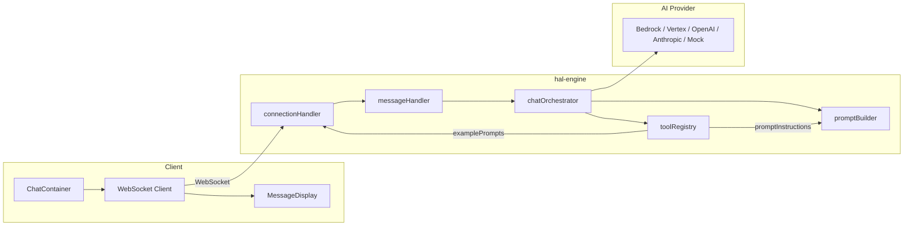
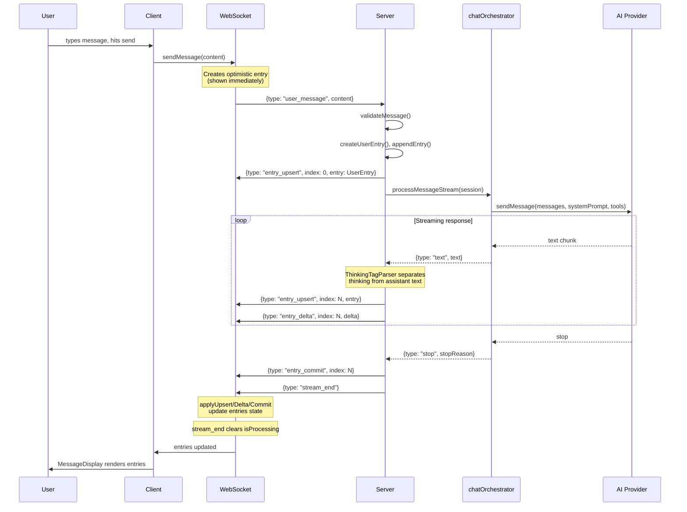
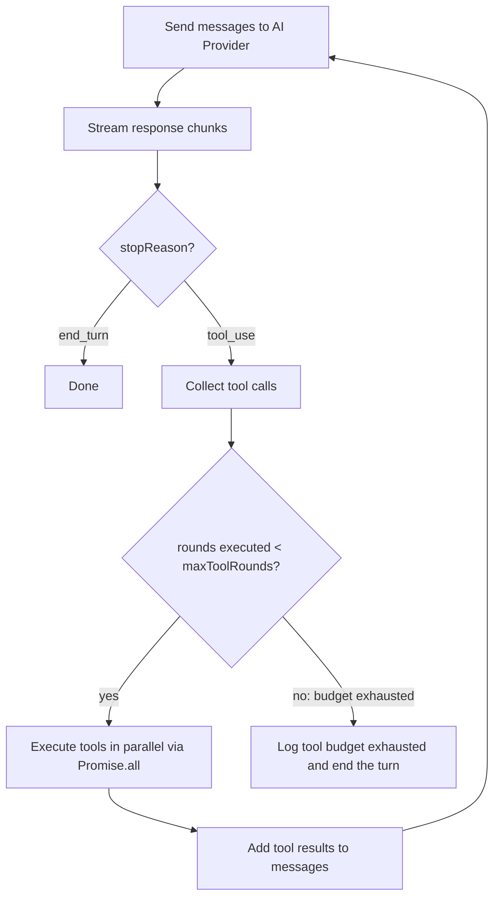

# Architecture

| Field  | Value       |
| ------ | ----------- |
| Issue  | n/a         |
| Status | In Progress |

This document walks through how the hal-engine system works, from the moment a user types a message to the moment they see a streaming response.

## The Big Picture

The system has three layers: a frontend client, a Node.js backend (hal-engine), and a pluggable AI provider. They communicate over WebSocket for real-time streaming.

Only the middle layer is this repository. The `Client` group below, the `applyUpsert`/`applyDelta`/`applyCommit` functions in Entry Streaming Protocol, the reconnection and unmount behaviour under Connection Lifecycle, and the spinner logic in Tool Execution Loop all describe a browser client. They are here because the protocol only makes sense as a pair, not because any of it ships from here.


```mermaid
graph LR
    subgraph Client
        CC[ChatContainer]
        WS[WebSocket Client]
        MD[MessageDisplay]
    end

    subgraph "hal-engine"
        CH[connectionHandler]
        MH[messageHandler]
        CO[chatOrchestrator]
        PB[promptBuilder]
        TR[toolRegistry]
    end

    subgraph "AI Provider"
        AI[Bedrock / Vertex / OpenAI / Anthropic / Mock]
    end

    CC --> WS
    WS -->|WebSocket| CH
    CH --> MH
    MH --> CO
    CO --> AI
    CO --> PB
    CO --> TR
    TR -->|promptInstructions| PB
    TR -->|examplePrompts| CH
    WS --> MD
```

## Source Layering

### Background

`src/` is five mandatory layers plus two cross-cutting folders, and the direction of import between them is the architecture rather than a convention. `layers.yaml` declares it as data and `re-lint/no-cross-layer-import` enforces it, so a shortcut fails lint rather than review. The documented order — types → providers → infrastructure → orchestration → transport — reads as a chain; the real graph is the DAG below.

### The declared graph

- `providers` is a sibling of `infrastructure`, not a link in the chain: neither may import the other, and both may reach `types` and `shared` and nothing further ([validated by: reports a sibling import both ways, because providers and infrastructure are not a chain](../../scripts/eslint-layers.test.ts#L62)).
- `orchestration` may not import `providers`: it depends on the `AIProvider` interface in `types` and never on a concrete provider, which is the property that lets a provider be swapped by configuration alone ([validated by: reports orchestration importing a concrete provider, the coupling the architecture forbids](../../scripts/eslint-layers.test.ts#L39)).
- `types` is the bottom layer and may import nothing, so every import out of it is upward and is reported ([validated by: reports an upward import from the bottom layer, which may import nothing](../../scripts/eslint-layers.test.ts#L47)).
- An import the layering does declare passes untouched, and movement inside a layer is free ([validated by: allows a downward import the layering declares](../../scripts/eslint-layers.test.ts#L53)).
- The gate governs files under `src/`, and that scope is checked rather than assumed: a matcher which silently matches nothing fails the suite ([validated by: governs files under src, so a matcher that silently matches nothing fails here](../../scripts/eslint-layers.test.ts#L111)).
- `shared` is cross-cutting: every layer above `types` may reach the logger it holds, and `types` is not among them — it may import nothing at all, the logger included ([validated by: lets every layer above types reach shared, but not types itself](../../scripts/eslint-layers.test.ts#L84)).
- `shared` itself imports nothing, which keeps it a leaf rather than a second composition root ([validated by: reports shared importing anything at all, so the cross-cutting layer stays a leaf](../../scripts/eslint-layers.test.ts#L78)).
- `.` — `src/config.ts` and `src/index.ts` — is the composition root, the one place allowed to see every layer, because assembling them is its job ([validated by: lets the composition root at src/ see every layer, because assembling them is its job](../../scripts/eslint-layers.test.ts#L94)).
- A folder with no entry in `layers.yaml` may import nothing, which is what keeps that file honest as `src/` grows ([validated by: gives a folder with no layers.yaml entry no imports at all](../../scripts/eslint-layers.test.ts#L103)).

### Rationale

This gate's failure mode is silence rather than a false report, which is why the suite pins that it still reports at all. The rule keys packages by `<package>/src/`, a shape that suits a monorepo of packages and not a single package whose code sits at `./src`. Left to locate `layers.yaml` on its own it resolves every file as `src/...`, matches no package and reports nothing — adopted in appearance, enforcing nothing. `eslint.config.mjs` re-homes the entries under this checkout's own directory name, with the root moved one level up, to give the matcher the shape it expects.

## Pluggable Interfaces

### Background

hal-engine is designed around pluggable interfaces that let consumers customize behavior without modifying internals.

### SessionStore

Controls where session data is stored: the default `InMemorySessionStore` keeps sessions in a `Map` ([validated by: creates and retrieves a session](../../src/infrastructure/stores/inMemorySessionStore.test.ts#L10)). Implement this interface to persist sessions in Redis, a database, or any other backing store. The store is generic -- pass your own session type extending `BaseSession`.

<!-- doc-block: src/types/sessionStore.ts#SessionStore -->
```typescript
interface SessionStore<T extends BaseSession = ChatSession> {
  create(sessionId: string, userId: string | number, options?: SessionCreateOptions): Awaitable<T>;
  get(sessionId: string): Awaitable<T | undefined>;
  delete(sessionId: string): Awaitable<boolean>;
  count(): Awaitable<number>;
  clear(): Awaitable<void>;
  /** Drops a session the client never received, without erasing anything a consumer would want kept. */
  evict?(sessionId: string): Awaitable<boolean>;
  /** Write signal: fires once per processed user message; failures are swallowed (specs/hal-engine-session-write-signal/spec.md). */
  save?(session: T): Awaitable<void>;
  /** The user's most recently active session the store still holds, so a connect that names none can continue it (specs/hal-engine-session-resume/spec.md). */
  latestFor?(userId: string | number): Awaitable<T | undefined>;
  /** Tells an expired session from a missing one; `missing` is always a permitted answer, and a store without it behaves as `get` (specs/hal-engine-session-resume/spec.md). */
  lookup?(sessionId: string): Awaitable<SessionLookup<T>>;
}
```

- `create` records the optional `authHeaders` and `workspaceId` on the session it returns, so a tool can later reach upstream services as the caller ([validated by: creates session with options](../../src/infrastructure/stores/inMemorySessionStore.test.ts#L19)).
- `get` returns `undefined` for a session id the store does not hold, rather than throwing ([validated by: returns undefined for unknown session](../../src/infrastructure/stores/inMemorySessionStore.test.ts#L31)).
- `delete` removes the session and reports `true` ([validated by: deletes a session](../../src/infrastructure/stores/inMemorySessionStore.test.ts#L35)).
- `delete` reports `false` for an id the store was not holding ([validated by: returns false when deleting nonexistent session](../../src/infrastructure/stores/inMemorySessionStore.test.ts#L42)).
- `count` reflects creates and deletes as they happen ([validated by: tracks count correctly](../../src/infrastructure/stores/inMemorySessionStore.test.ts#L46)).
- `clear` empties the store, leaving `count` at zero and every previous id unresolvable ([validated by: clears all sessions](../../src/infrastructure/stores/inMemorySessionStore.test.ts#L60)).
- `save` is the optional write signal the engine calls once per processed user message, detailed in [the session write signal spec](../hal-engine-session-write-signal/spec.md); a store that omits it, as `InMemorySessionStore` does, is unaffected ([validated by: logs nothing for a store that implements no save](../../src/orchestration/sessionSave.test.ts#L67)).

### WsAuthenticator

Authenticates WebSocket connections during the handshake. It receives the whole Node `IncomingMessage`, not a pre-extracted token, so it can read credentials from wherever the client put them. Return the authenticated user to accept the connection, or `null` to reject it with HTTP 401 -- a rejection is a returned `null`, not a thrown error.

<!-- doc-block: src/types/auth.ts#WsAuthenticator -->
```typescript
type WsAuthenticator = (req: IncomingMessage) => Promise<AuthenticatedUser | null>;
```

<!-- doc-block: src/types/session.ts#AuthenticatedUser -->
```typescript
interface AuthenticatedUser {
  id: string | number;
  [key: string]: unknown;
}
```

The connection handler takes `id` as the session's `userId` and picks up `workspaceId` when the returned user carries one. Separately, and regardless of what this function reads, the engine forwards the first `Sec-WebSocket-Protocol` value that is not the `hal.v1` marker as `Bearer <token>` in the session's `authHeaders.authorization`, so a tool can proxy the caller's credentials upstream. The client offers two values, `hal.v1, <access-token>`, and the server answers only `hal.v1`.

### AIProvider

The core abstraction for AI model communication. Each provider (Bedrock, Vertex, OpenAI, Anthropic) implements this interface. The orchestrator depends only on this interface, never on provider-specific code.

<!-- doc-block: src/types/ai.ts#AIProvider -->
```typescript
interface AIProvider {
  sendMessage(params: SendMessageParams): AsyncGenerator<MessageChunk>;
  generateStructured<T>(params: StructuredOutputParams<T>): Promise<T>;
}
```

- `sendMessage` streams responses for user-facing output ([validated by: streams word-by-word response echoing user input](../../src/providers/mock/mockProvider.test.ts#L7)).
- `generateStructured` returns typed JSON for internal AI decisions, such as evaluation, classification and structured extraction ([validated by: returns default values matching schema shape](../../src/providers/mock/mockProvider.test.ts#L72)).

### PromptStore

Loads prompt templates by name with variable substitution ([validated by: returns prompt template when found](../../src/infrastructure/stores/inMemoryPromptStore.test.ts#L11), [resolve](../../src/infrastructure/stores/inMemoryPromptStore.test.ts#L28)). Use this for database-driven prompts instead of static `PromptBuilder` configuration.

<!-- doc-block: src/types/promptStore.ts#PromptStore -->
```typescript
interface PromptStore {
  findByName(name: string): Promise<PromptTemplate | undefined>;
  resolve(name: string, variables?: Record<string, string>): Promise<string>;
}
```

- `findByName` returns `undefined` for a name the store does not hold ([validated by: returns undefined when not found](../../src/infrastructure/stores/inMemoryPromptStore.test.ts#L17)).
- `resolve` returns a template with no placeholders unchanged ([validated by: returns template without substitution when no variables](../../src/infrastructure/stores/inMemoryPromptStore.test.ts#L23)).
- `resolve` substitutes every variable it is given ([validated by: substitutes multiple variables](../../src/infrastructure/stores/inMemoryPromptStore.test.ts#L33)).
- A placeholder appearing more than once is substituted at every occurrence, not only the first ([validated by: substitutes all occurrences of same variable](../../src/infrastructure/stores/inMemoryPromptStore.test.ts#L42)).
- A placeholder with no matching variable is left in the output verbatim, so a missing value shows up as `{role}` rather than as a blank the reader cannot spot ([validated by: leaves unmatched placeholders intact](../../src/infrastructure/stores/inMemoryPromptStore.test.ts#L47)).
- `resolve` rejects when the prompt name is unknown, because a caller asking for a template by name has no sensible fallback ([validated by: throws when prompt not found](../../src/infrastructure/stores/inMemoryPromptStore.test.ts#L52)).

### UsageStore

Tracks AI call metadata such as token counts and model version, for cost monitoring ([validated by: records and retrieves usage by session](../../src/infrastructure/stores/inMemoryUsageStore.test.ts#L24)).

<!-- doc-block: src/types/usageStore.ts#UsageStore -->
```typescript
interface UsageStore {
  record(entry: UsageRecord): Promise<void>;
  getBySession(sessionId: string): Promise<UsageRecord[]>;
}
```

- `getBySession` returns an empty array for a session with no records, never `undefined`, so a caller can total the results without a null check ([validated by: returns empty array for unknown session](../../src/infrastructure/stores/inMemoryUsageStore.test.ts#L31)).
- `getBySession` returns only the records of the session asked for, in the order they were recorded ([validated by: filters by session ID](../../src/infrastructure/stores/inMemoryUsageStore.test.ts#L35)).

### PromptBuilderConfig

Configures static system prompt assembly. Provide your AI identity, domain context, response guidelines, and custom instructions. The `PromptBuilder` combines these with tool instructions from the registry into the final system prompt.

<!-- doc-block: src/infrastructure/builders/promptBuilder.ts#PromptBuilderConfig -->
```typescript
interface PromptBuilderConfig {
  identity: string;
  domainContext?: string;
  responseGuidelines?: string;
  toolPreamble?: string;
}
```

`toolPreamble` overrides the built-in instructions that tell the model when to reach for a tool; leave it unset to keep the default.

### OrchestratorHooks

Async lifecycle hooks for customizing the orchestration flow. Every hook is optional and receives the current session, and an orchestrator built with none behaves exactly as one built with an empty set ([validated by: works without any hooks configured](../../src/orchestration/chatOrchestrator.test.ts#L439)). Install hooks through `HalEngineConfig.orchestrator.hooks`; `createHalEngine` forwards the set to the orchestrator ([validated by: forwards an orchestrator hook, so one passed through the config actually fires](../../src/config.test.ts#L19)).

<!-- doc-block: src/orchestration/chatOrchestrator.ts#OrchestratorHooks -->
```typescript
interface OrchestratorHooks {
  beforeSession?: (session: ChatSession) => Promise<void>;
  afterSession?: (session: ChatSession) => Promise<void>;
  beforeUserInput?: (session: ChatSession, userMessage: string) => Promise<string>;
  afterUserInput?: (session: ChatSession, userMessage: string) => Promise<void>;
  beforeModelResponse?: (session: ChatSession, systemPrompt: string) => Promise<string>;
  afterModelResponse?: (session: ChatSession, responseText: string, totalUsage?: UsageMetadata) => Promise<void>;
  onError?: (session: ChatSession, error: Error) => Promise<void>;
  /** The supported seam for an EU AI Act Art. 14 human-oversight control: fires before each known tool's executor, and a returned ToolResponse replaces the call (see docs/adding-a-tool.md); it receives the model's raw tool input and, through session, the caller's authHeaders, so a policy that logs either logs personal data and credential material; the engine asserts nothing about any policy installed here. */
  beforeToolCall?: (session: ChatSession, call: ToolCall) => Promise<ToolResponse | undefined>;
  /** Fires when the model asks for a tool round the budget refuses, after the last provider call and before afterModelResponse; a returned string reaches the user as the turn's closing text, and the engine writes none of its own (see specs/hal-engine-tool-budget/spec.md). */
  onToolBudgetExhausted?: (session: ChatSession, budget: ToolBudgetInfo) => Promise<string | undefined>;
}
```

The hooks fire in this order:

```
beforeSession → beforeUserInput → afterUserInput → beforeModelResponse → ...streaming (beforeToolCall × each tool call, each round)... → onToolBudgetExhausted (only on an exhausted budget) → afterModelResponse → afterSession
```

- The order above holds for a successful pass ([validated by: calls all hooks in correct order](../../src/orchestration/chatOrchestrator.test.ts#L366)).
- When the stream fails, `afterModelResponse` is skipped and the tail becomes `onError` then `afterSession` ([validated by: error path calls onError then afterSession](../../src/orchestration/chatOrchestrator.test.ts#L406)).
- `beforeSession` runs before any other hook ([validated by: called before anything else](../../src/orchestration/chatOrchestrator.test.ts#L123)).
- `beforeUserInput` receives the content of the last user message ([validated by: receives the last user message content](../../src/orchestration/chatOrchestrator.test.ts#L191)).
- `beforeUserInput` can modify that message by returning a different string ([validated by: modifies user message when returning different value](../../src/orchestration/chatOrchestrator.test.ts#L206)).
- `afterUserInput` receives the message as `beforeUserInput` left it, not as the client sent it ([validated by: receives user message after any beforeUserInput modification](../../src/orchestration/chatOrchestrator.test.ts#L221)).
- `beforeModelResponse` can replace the system prompt, for example loading it from a `PromptStore` ([validated by: replaces system prompt with returned value](../../src/orchestration/chatOrchestrator.test.ts#L238)).
- `afterModelResponse` receives the collected response text and the usage the provider reported ([validated by: receives collected response text and usage](../../src/orchestration/chatOrchestrator.test.ts#L253)).
- `afterModelResponse` does not run when the stream throws, so it never reports a response that was not delivered ([validated by: not called when stream throws](../../src/orchestration/chatOrchestrator.test.ts#L273)).
- `onError` receives the session and the error ([validated by: called with session and error when stream fails](../../src/orchestration/chatOrchestrator.test.ts#L295)).
- `onError` observes rather than handles: the error still propagates to the caller after it returns ([validated by: error still propagates after onError hook](../../src/orchestration/chatOrchestrator.test.ts#L317)).
- `onToolBudgetExhausted` fires only when the model asks for a tool round the budget refuses: after the last provider call and before `afterModelResponse`, which then receives the hook's sentence at the end of the response text ([validated by: hands afterModelResponse text ending in the sentence, and the usage of a run without the hook](../../src/orchestration/toolBudget.test.ts#L214)).
- `afterSession` runs after everything else completes ([validated by: called after everything completes](../../src/orchestration/chatOrchestrator.test.ts#L162)).
- `afterSession` fires even on error ([validated by: called even when an error occurs](../../src/orchestration/chatOrchestrator.test.ts#L172)).

A hook receives the full `session` object, so it has access to `session.authHeaders?.authorization` (the caller's bearer token forwarded from the WebSocket upgrade request) and every user message verbatim through `session.entries`; the engine redacts nothing before calling a hook. Anything a hook persists becomes the deployer's own data-retention obligation.

## Message Lifecycle

Here is what happens from the moment a user hits "send" to the moment they see a response streaming in:


```mermaid
sequenceDiagram
    participant U as User
    participant CC as Client
    participant WS as WebSocket
    participant S as Server
    participant CO as chatOrchestrator
    participant AI as AI Provider

    U->>CC: types message, hits send
    CC->>WS: sendMessage(content)
    Note over WS: Creates optimistic entry<br/>(shown immediately)
    WS->>S: {type: "user_message", content}

    S->>S: validateMessage()
    S->>S: createUserEntry(), appendEntry()
    S->>WS: {type: "entry_upsert", index: 0, entry: UserEntry}

    S->>CO: processMessageStream(session)
    CO->>AI: sendMessage(messages, systemPrompt, tools)

    loop Streaming response
        AI-->>CO: text chunk
        CO-->>S: {type: "text", text}
        Note over S: ThinkingTagParser separates<br/>thinking from assistant text
        S->>WS: {type: "entry_upsert", index: N, entry}
        S->>WS: {type: "entry_delta", index: N, delta}
    end

    AI-->>CO: stop
    CO-->>S: {type: "stop", stopReason}
    S->>WS: {type: "entry_commit", index: N}
    S->>WS: {type: "stream_end"}

    Note over WS: applyUpsert/Delta/Commit<br/>update entries state
    Note over WS: stream_end clears isProcessing
    WS->>CC: entries updated
    CC->>U: MessageDisplay renders entries
```

### One message at a time

The transport queues each `user_message` run on a `PerSessionLock` (`src/shared/perSessionLock.ts`) keyed by the session id, not the socket, since a resumed session can be open on more than one (re-cinq/HALEngine#47). What that means on the wire is in [the protocol spec, § 4.1](../hal-engine-websocket-protocol/spec.md#41-user_message).

- The lock runs two callbacks on one key in call order: the second starts only once the first has settled ([validated by: runs two callbacks on one key in call order, the second only once the first has settled](../../src/shared/perSessionLock.test.ts#L16)).
- Callbacks on different keys never wait for each other ([validated by: starts callbacks on different keys without either waiting for the other](../../src/shared/perSessionLock.test.ts#L34)).
- A callback that throws hands its rejection to its own caller, and the next callback on that key still runs ([validated by: hands a rejection to its own caller and still runs the next callback on that key](../../src/shared/perSessionLock.test.ts#L53)).
- The lock holds a key only while a callback on it is queued or running, and nothing but keys and promises, so an idle server keeps no session id and no message content ([validated by: holds no key once every queued callback has settled](../../src/shared/perSessionLock.test.ts#L68)).

## Entry Streaming Protocol

Every piece of content in the conversation is a **SessionEntry**. The protocol has two halves that mirror each other: the server mutates its session array and sends a frame describing the change, and the client applies that frame to its own copy.

### On the server

`src/orchestration/entryMutations.ts` holds three functions, and all three mutate `session.entries` in place.

| Function      | Signature                         | Effect                                              |
| ------------- | --------------------------------- | --------------------------------------------------- |
| `appendEntry` | `(session, entry) => number`      | Pushes the entry and returns the index it landed at |
| `appendDelta` | `(session, index, delta) => void` | Concatenates onto `entry.content`                   |
| `commitEntry` | `(session, index) => void`        | Sets `isStreaming = false`                          |

`appendEntry` returns a number because its caller needs that index for the frame it sends next. The other two return nothing, because the mutation is the result.

`appendDelta` and `commitEntry` act only on `assistant` and `thinking` entries. Called against a `user` or `tool` entry they do nothing and report nothing -- neither role carries streaming content, so there is no failure to report.

### On the wire

Four frame types, not three.

| Server message | Sent when                                        | Client function                       |
| -------------- | ------------------------------------------------ | ------------------------------------- |
| `entry_upsert` | an entry is created, or replaced at an index     | `applyUpsert()`                       |
| `entry_delta`  | text is appended to a streaming entry            | `applyDelta()`                        |
| `entry_commit` | an entry is finalised                            | `applyCommit()`                       |
| `entry_skip`   | an entry exists server-side but is not forwarded | none -- the client advances its index |

`entry_skip` is what a suppressed assistant response produces. The entry stays in the session so the model's next turn sees it, and the client is told to move past that index without rendering anything. The WebSocket protocol spec covers the index arithmetic in its § 8.2.

The client's `applyUpsert`/`applyDelta`/`applyCommit` return new arrays and never mutate. The server's three do the opposite. That asymmetry is deliberate: the server owns one session object for the life of a connection, while the client re-renders from a fresh array.

## Tool Execution Loop

When the orchestrator is created, it builds the system prompt via `PromptBuilder`. The `ToolRegistry` provides `promptInstructions` from each tool, and `PromptBuilder` assembles them alongside the AI's identity, domain context, and response guidelines into the final system prompt sent to the provider.

When the AI model decides it needs data (like weather information or a database lookup), it requests a tool call. The orchestrator handles this in a loop:


```mermaid
flowchart TD
    A[Send messages to AI Provider] --> B[Stream response chunks]
    B --> C{stopReason?}
    C -->|end_turn| D[Done]
    C -->|tool_use| E[Collect tool calls]
    E --> H{rounds executed < maxToolRounds?}
    H -->|yes| F[Execute tools in parallel via Promise.all]
    H -->|no: budget exhausted| X[Log tool budget exhausted and end the turn]
    F --> G[Add tool results to messages]
    G --> A
```

Here is what the message handler does when a tool call comes through:

1. The model yields a `tool_use` chunk with tool name and input
2. The handler creates a `ToolEntry` and sends it to the client via `entry_upsert`
3. The orchestrator executes the tool (via `ToolRegistry.execute()`)
4. Tool results get added to the conversation as a `tool_result` message
5. If the tool returned `clientMessages`, they are forwarded to the frontend as-is, in one `tool_result` chunk ([validated by: forwards the client messages a tool returned as one tool_result chunk](../../src/orchestration/chatOrchestrator.test.ts#L516))
6. If the tool set `suppressAssistantResponse`, the AI's next reply is kept in session context but hidden from the frontend ([validated by: asks for suppression when the tool says the reply is already handled](../../src/orchestration/chatOrchestrator.test.ts#L546))
7. The orchestrator re-queries the AI provider with the updated messages, and the chunks of every round reach the client in order ([validated by: runs another round after a tool call and streams both rounds in order](../../src/orchestration/chatOrchestrator.test.ts#L481))
8. This repeats until the budget is spent: at most `maxToolRounds` tool rounds are executed, and the provider is called at most `maxToolRounds + 1` times, so the default of 5 executes five rounds and makes six model calls, the last of which reads the fifth round's results. A round requested after that is not executed; see [the tool budget spec](../hal-engine-tool-budget/spec.md) ([validated by: executes 5 tool rounds and makes 6 provider calls at the default budget](../../src/orchestration/toolBudget.test.ts#L95), [validated by: stops asking for tools once maxToolRounds is spent](../../src/orchestration/chatOrchestrator.test.ts#L502))

### Whether a round continues

- A round continues only when the model stopped for `tool_use`, named at least one tool, and a `ToolRegistry` is configured ([validated by: continues when the model requested a tool and a registry can run it](../../src/orchestration/orchestratorHelpers.test.ts#L11)).
- With no registry configured the loop stops, whatever the model asked for, because nothing could execute the call ([validated by: stops when no registry is configured, whatever the model asked for](../../src/orchestration/orchestratorHelpers.test.ts#L15)).
- A `tool_use` stop naming no tool stops the loop, rather than re-querying with nothing to add ([validated by: stops when the model named no tool](../../src/orchestration/orchestratorHelpers.test.ts#L19)).
- Any other stop reason ends the loop even when tool calls are pending ([validated by: stops when the model finished for a reason other than tool use](../../src/orchestration/orchestratorHelpers.test.ts#L23)).

### Across rounds

- The loop ends as soon as a round stops with `end_turn`, and nothing further is asked of the provider ([validated by: stops after one round when nothing asked for a tool](../../src/orchestration/chatOrchestrator.test.ts#L493)).
- An `entry_upsert` a tool returns is appended to the session and its index rewritten to the position it actually landed in, because a tool cannot know how long the session already is ([validated by: appends an upserted entry to the session and rewrites its index to match](../../src/orchestration/chatOrchestrator.test.ts#L529)).
- The response text a hook sees is the text of every round joined, not only the last ([validated by: joins the text of every round, not only the last](../../src/orchestration/chatOrchestrator.test.ts#L558)).
- Usage an earlier round reported is kept when a later round reports none, so a tool round does not erase the token count ([validated by: keeps the usage an earlier round reported when a later round reports none](../../src/orchestration/chatOrchestrator.test.ts#L590)).
- The usage `afterModelResponse` receives is `totalUsage`: the sum of what every provider call in the turn reported, so a turn that ran tools counts every round rather than the last one alone ([validated by: sums the usage of every round, not only the last](../../src/orchestration/chatOrchestrator.test.ts#L608)).
- A round that reports no usage drops out of the sum rather than voiding it: the rounds that did report are still counted, and a turn where nothing reported reports nothing ([validated by: counts every reporting round even when a round between them reports none](../../src/orchestration/chatOrchestrator.test.ts#L630)).

The frontend shows a spinner on the last tool entry while the stream is still processing (`isProcessing` is `true`). The `stream_end` message clears the processing state, which hides the spinner. This works correctly even when tool suppression prevents assistant entries from reaching the frontend. See [tool-responses.md](../hal-engine-tool-responses/spec.md) for details on client messages and suppression.

## Thinking Tag Parsing

The AI model can wrap internal reasoning in `<thinking>...</thinking>` tags. The `ThinkingTagParser` separates these from user-facing text during streaming.

```
Input stream: "Let me check<thinking>I should use the weather tool</thinking>The forecast is..."

Parsed segments:
  {type: 'text',     content: 'Let me check'}
  {type: 'thinking', content: 'I should use the weather tool'}
  {type: 'text',     content: 'The forecast is...'}
```

The parser is stateful and handles partial tags at chunk boundaries. For example, if a chunk ends with `</thin`, the parser buffers it until the next chunk completes the tag. Its full contract is in `specs/hal-engine-thinking-tag-parser/spec.md`.

The message handler routes these segments to different entries:

- `thinking` segments go into a `ThinkingEntry` (collapsible in the UI)
- `text` segments go into an `AssistantEntry` (rendered as markdown)

When a thinking block closes, the handler commits the `ThinkingEntry` before starting (or continuing) the `AssistantEntry`.

## Connection Lifecycle

### Establishing a connection

1. The client calls `POST {basePath}/chats` to create a chat, getting back a `chatId`
2. The client builds a WebSocket URL: `wss://{host}{basePath}/ws`, adding `?sessionId={sessionId}` on a reconnect that wants its conversation back. The server checks only the `{basePath}/ws` prefix; the query parameter is not a credential, and with `transport.resume` enabled it is honoured only for the connection's own authenticated user (step 5)
3. The client offers two WebSocket subprotocols, `hal.v1, <access-token>` (no query string exposure), and the server answers only the `hal.v1` marker, so the token never appears in the response
4. The server's `handleUpgrade` passes the upgrade request to the configured `WsAuthenticator`, which returns a user or `null`, before completing the handshake; what it reads from that request - a header, a cookie, a subprotocol - is the consumer's business, not this package's
5. On connection, the server creates a `ChatSession` and sends a `connected` message (including `examplePrompts` collected from the tool registry). With resume enabled, a requested id whose stored session belongs to the connecting user is rejoined instead: the frame carries `resumed: true` and `entryCount`, and the stored entries are replayed; any other id gets a fresh, server-minted session and `resumed: false`

### Heartbeat

- The server sends a WebSocket `ping` frame at the configured `heartbeatIntervalMs` interval (default 30 seconds)
- If a client doesn't respond with `pong`, the connection is terminated
- The client can also send application-level `ping` messages
- The server responds with `pong` messages (used for UI health indicators)

### Reconnection

When a connection drops, the frontend reconnects automatically:

- Exponential backoff: `1000ms * 2^retryCount` + random jitter (0-1000ms)
- Maximum delay: 31 seconds, per the formula in the websocket-protocol spec, Section 11.3
- Maximum retries: 5
- On reconnection, any queued messages are flushed immediately
- Entries are cleared on disconnect (the server will re-send them on the new session)

### Cleanup

- On unmount, the client closes the socket and clears all timers
- On disconnect, the server keeps the session and fires `onDisconnect`; it erases nothing, and the default store bounds its own memory by age instead
- On `SIGTERM`, nothing happens: no signal handler is installed. `createServer` exposes `stop()`, which closes every socket with code 1001 and clears the heartbeat, but the engine never calls it (websocket-protocol spec, Section 11.2)

## App Extension Points

### App extension points

`createApp` exposes two callbacks that let a consumer mount routes alongside the engine's own routes without hand-building an Express application.

- `HalAppOptions.rootRoutes?: (router: Router) => void` — a callback invoked with a fresh `Router` and mounted at the root of the app, after the `basePath` router and before the catch-all `404`, so a handler registered there can serve `GET /` while `GET {basePath}/health` still answers. ([validated by: mounts a rootRoutes handler at / before the catch-all 404](../../src/transport/createApp.test.ts#L128))
- A `rootRoutes` route at a path that also appears under the `basePath` prefix answers independently: `GET /health` goes to the root handler and `GET {basePath}/health` goes to the engine's health route. ([validated by: lets rootRoutes at /health and the basePath health answer independently](../../src/transport/createApp.test.ts#L143))
- `HalEngineConfig.transport.additionalRoutes` is forwarded to `createApp`, so a route registered there mounts under `basePath` in the server the engine builds. ([validated by: forwards transport.additionalRoutes to createApp so the route mounts under basePath](../../src/config.test.ts#L209))
- Neither `additionalRoutes` nor `rootRoutes` is covered by `auth.http`; both receive requests before any authentication middleware the engine installs, so a consumer applies its own middleware inside the callback.
- Both callbacks inherit the CORS, JSON body-parsing, and cookie-parsing middleware that `createApp` mounts unconditionally.
- `engine.app` cannot be extended after `createHalEngine` returns: `createApp` registers a terminal `404` catch-all before returning, and Express matches routes in registration order, so a route added afterwards always returns `404`.

The default error behaviour: with no `errorHandler` supplied and `NODE_ENV` unset or not `production`, an unhandled error in any route returns `500 text/html` containing the stack trace (`finalhandler` default). Supply `errorHandler` or set `NODE_ENV=production` to avoid leaking stack content.

**GDPR.** Anything a forwarded route logs or returns is outside every control the engine applies to conversation content. The default HTML error page can leak request content into a response body and into `stderr`; the one-line mitigation is `NODE_ENV=production` or supplying `errorHandler`.

**NIS-2 (Art. 21), access controls.** A route added through either option is unauthenticated by default. The consumer applies its own middleware inside the callback.

## Engine Lifecycle

`createHalEngine` assembles every layer of the engine from the supplied configuration and exposes the result through a single object.

- `orchestrator.hooks` passed in the configuration are forwarded to the orchestrator, so a hook fires during the message lifecycle exactly as if it had been passed to `createChatOrchestrator` directly. ([validated by: forwards an orchestrator hook, so one passed through the config actually fires](../../src/config.test.ts#L19))
- `transport.port` is forwarded to the HTTP server: the server listens on the port the configuration declares. ([validated by: forwards transport.port, so the server listens where the config said](../../src/config.test.ts#L36))
- An explicit port argument passed to `engine.start(port)` wins over `transport.port`, so the caller can override the configured port at runtime without changing the configuration. ([validated by: lets an explicit start(port) win over the configured one](../../src/config.test.ts#L47))
- When a `logger` is supplied in the configuration, the engine routes its own log lines through it, so the caller receives the same lines they would otherwise see on `stdout`. ([validated by: delivers the package's own log lines to a supplied logger](../../src/config.test.ts#L65))
- When no `logger` is named in the configuration, the engine leaves any already-installed logger in place, so a caller that set a logger before calling `createHalEngine` keeps their choice. ([validated by: leaves an already-supplied logger in place when the config names none](../../src/config.test.ts#L78))
- When `start()` cannot bind the port (for example because another process holds it), it rejects the returned promise rather than emitting an unhandled `error` event, so the caller can handle the failure in a `catch` block. ([validated by: rejects instead of taking the process down with an unhandled error event](../../src/config.test.ts#L195))

## Provider resilience

An `AIProvider` can fail transiently — a rate-limited vendor, a request that is accepted and then never streams a chunk. `AIError.retryable` already classifies which failures are worth a second attempt, and both shipped providers set it, but the engine reads the flag through one place only: the `withRetry(provider, policy)` decorator in `src/providers/withRetry.ts`, which wraps any `AIProvider` — real or mock — at the interface boundary so no provider carries its own retry loop.

`RetryPolicy` is entirely optional and defaults to `maxAttempts: 3`, `baseDelayMs: 500`, `maxDelayMs: 5000`, `firstChunkTimeoutMs: 30000`, `idleChunkTimeoutMs: 30000`. Both `withRetry` and `RetryPolicy` are re-exported from `src/index.ts`, and `HalEngineConfig` gains an optional `resilience?: RetryPolicy` block: when present, `createHalEngine` wraps the provider between `createProvider` and `createChatOrchestrator`; when absent, the provider is passed through untouched, so today's behaviour is unchanged. This is the first tier of operational resilience and is distinct from the client-side WebSocket reconnection backoff described under Connection Lifecycle: that backoff lives in the browser client and re-establishes a dropped socket, while this one lives in the engine and re-issues a failed model call.

- A retryable `AIError` is retried, and the eventual success is streamed to the caller ([validated by: retries a retryable failure, aborting each failed attempt, and streams the success of the third call](../../src/providers/withRetry.test.ts#L30)).
- Each attempt reaches the provider as `params.signal` with a signal of its own, and an attempt that fails is aborted before the next one starts, so whatever request it left behind is told to stop ([validated by: retries a retryable failure, aborting each failed attempt, and streams the success of the third call](../../src/providers/withRetry.test.ts#L30)).
- A caller's own `params.signal` is composed with each attempt's rather than replaced by it, so aborting it still reaches the provider ([validated by: composes a caller signal with each attempt signal, so a caller abort still reaches the provider](../../src/providers/withRetry.test.ts#L51)).
- A non-retryable `AIError` is attempted exactly once and propagates unchanged — same class, same `code` ([validated by: does not retry a non-retryable failure and propagates the same error unchanged](../../src/providers/withRetry.test.ts#L72)).
- Once the first chunk has been handed to the caller the attempt is uninterruptible: a later failure propagates without a retry, because the chunks already streamed cannot be un-sent ([validated by: does not retry once the first chunk has been handed off, even on a retryable failure](../../src/providers/withRetry.test.ts#L98)).
- When every attempt fails, `withRetry` throws an `AIError` carrying the last attempt's `code`, so the orchestrator's `error instanceof Error` guard passes and a later failover path can act on the final failure ([validated by: gives up after maxAttempts and throws an AIError carrying the last attempt code](../../src/providers/withRetry.test.ts#L128)).
- `firstChunkTimeoutMs` bounds a hung request: an attempt whose first chunk never arrives is abandoned — its signal is aborted when the timeout fires and its iterator's `return()` is called to release the generator — and retried ([validated by: abandons an attempt whose first chunk never arrives, aborts its signal, calls return on it, and retries](../../src/providers/withRetry.test.ts#L151)).
- `idleChunkTimeoutMs` bounds a stalled stream once output has begun: it surfaces as an `AIError` with code `TIMEOUT` and is not retried, because output has already reached the caller, and the abandoned attempt's signal is aborted and its iterator’s `return()` called so the generator is released ([validated by: throws a TIMEOUT AIError, aborts and returns the stalled attempt, and does not retry when the stream stalls after its first chunk](../../src/providers/withRetry.test.ts#L198)).
- Backoff is exponential with full jitter capped at `maxDelayMs`: the wait before attempt two falls within `[0, baseDelayMs]` and before attempt three within `[0, 2 × baseDelayMs]` ([validated by: backs off with full jitter, bounding attempt two to baseDelay and attempt three to twice it](../../src/providers/withRetry.test.ts#L253)).
- `generateStructured` is wrapped by the same attempt-and-backoff loop; it returns a `Promise` rather than a stream, so the first-chunk rule does not apply and a retry there is unconditionally safe ([validated by: retries generateStructured under the same attempt-and-backoff loop](../../src/providers/withRetry.test.ts#L299)).
- An engine configured with no `resilience` block processes a message exactly as it does today, so the field is optional in fact and not only in the type ([validated by: processes a message unchanged when the config declares no resilience block](../../src/config.test.ts#L115)).
- An engine configured with a `resilience` block answers the same message with the same reply, so wrapping the provider is invisible to a turn that does not fail ([validated by: processes a message to the same reply when the config declares a resilience block](../../src/config.test.ts#L121)).

Each retry re-sends the entire conversation — every message verbatim — to the model vendor again, so `maxAttempts` multiplies the volume of personal data crossing any jurisdictional boundary the deployment sits across. Aborting an abandoned attempt stops the vendor sending on Bedrock but not on Vertex, where the abandoned request still runs to completion beside its retry (specs/hal-engine-providers/spec.md § Cancellation). The decorator logs the attempt number, the `AIError.code` and the delay only; it never logs message content, the system prompt, tool arguments, or any auth header field, consistent with the engine redacting nothing elsewhere.

### Decision

Retry is tier one of the resilience path: transient provider blips are absorbed here, before a sustained outage is handed to _Fail over to a second provider when one is sustainedly unavailable_, which owns the failover decision once this tier has given up. Widening what a provider classifies as retryable (the Vertex classifier matches only `429` / `RESOURCE_EXHAUSTED`, so a `503` is not retried under this policy) is provider behaviour with its own scope and belongs with that failover work, not here. Cancelling the underlying HTTP request of an abandoned attempt is out of scope and tracked as _Carry a cancellation signal into the provider SDK_: `return()` releases the generator but cannot abort the in-flight request today.

## Source Files

| Concern                 | File                                              |
| ----------------------- | ------------------------------------------------- |
| Entry point / config    | `src/config.ts`                                   |
| Shared session types    | `src/types/session.ts`                            |
| AI provider interface   | `src/types/ai.ts`                                 |
| Message types           | `src/types/messages.ts`                           |
| Auth interfaces         | `src/types/auth.ts`                               |
| Session store interface | `src/types/sessionStore.ts`                       |
| Prompt builder          | `src/infrastructure/builders/promptBuilder.ts`    |
| Chat orchestrator       | `src/orchestration/chatOrchestrator.ts`           |
| Conversation context    | `src/orchestration/conversationContext.ts`        |
| WebSocket sender        | `src/transport/ws/sender.ts`                      |
| Message validation      | `src/transport/ws/validation.ts`                  |
| Message handling        | `src/transport/ws/messageHandler.ts`              |
| Connection handler      | `src/transport/ws/connectionHandler.ts`           |
| Tool registry           | `src/orchestration/tools/registry.ts`             |
| Entry factories         | `src/orchestration/entryFactories.ts`             |
| Entry mutations         | `src/orchestration/entryMutations.ts`             |
| Thinking tag parser     | `src/infrastructure/parsers/thinkingTagParser.ts` |
